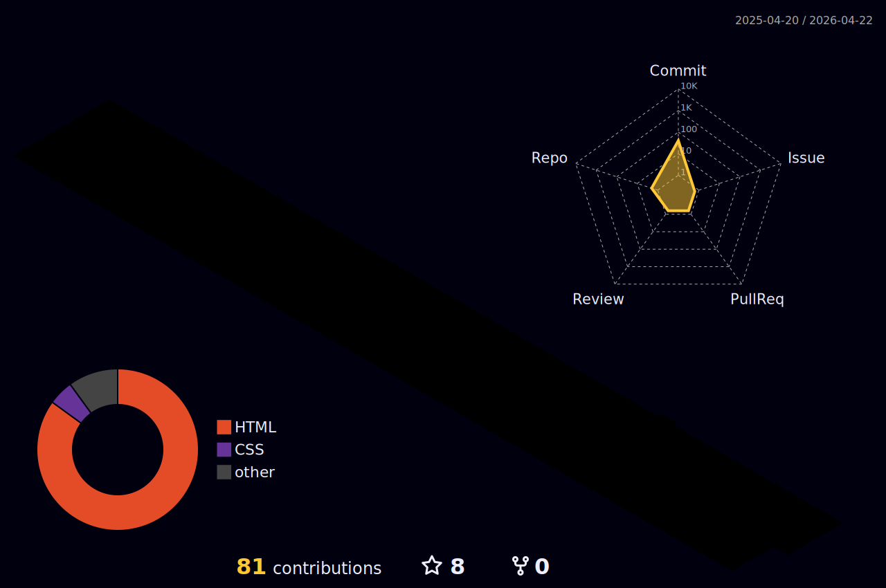

<h3 align="center">Hey, I'm Marcus Caiado !</h3>
<h3 align="center">A passionate developer whose always trying to think out of the box !</h3>

<h3 align="center">At the moment learning Solidity to write smart contracts at DAPPs on the Web3.</h3>

<h3 align="center">Languages and Tools:</h3>

 
 
 
 

 
<h3 align="center">My GitHub Stats:</h3>

  

 
 

